# EXPLANATORY 2-STAGE WIND POWER FORECASTING ARCHITECTURE
## Detailed Enterprise Architecture with Full Aerodynamic, Thermodynamic, Telemetric, and Regulatory Specifications

---

```
========================================================================================================================
                               EXPLANATORY 2-STAGE WIND POWER FORECASTING ARCHITECTURE
               Detailed Enterprise Architecture with Full Aerodynamic, Telemetric & Regulatory Specifications
========================================================================================================================
                                                         ▼
 [LAYER 1: TRIGGER & ORCHESTRATION ENGINE] ── AWS Serverless (EventBridge Cron & 30-Min Rolling Gates)
                                                         ▼
 [LAYER 2: MULTI-SOURCE TELEMETRY & INGESTION] ── 80m Hub NWP, Virtual SCADA & Thermodynamic Air Density
                                                         ▼
 [STAGE 1: AERODYNAMICS & ROTOR PHYSICS ANCHOR] ── IEC Density Scaling, Gamesa G114 Curve & Park Derate
                                                         ▼
 [STAGE 2: MULTI-MODEL ENSEMBLE & AI ARBITRATION] ── 143-Member Selection, Jensen's Safe Power & MPERC Shield
                                                         ▼
 [LAYER 5: 96-BLOCK MASTER ASSEMBLY & S3 LAKE] ── 90-Min Freeze Boundary & Continuous 24h Grid Dispatch
========================================================================================================================
```

---

## 🕒 LAYER 1: Trigger & Orchestration Engine (AWS Serverless)
**Automated Cron & Dispatch | 30-Minute Rolling Cadence (06:00 to 21:00 IST) | 90-Min Freeze Horizon**

### 1. AWS EventBridge Cron Architecture (31 Daily Rolling Gates)
* **Active Revision Window**: Every 30 minutes from **06:00 to 21:00 IST** (9:00 PM night).
* **Dual UTC Cron Schedule**:
  * `cron(30 0-15 * * ? *)` $\rightarrow$ Triggers at minute 30 of UTC hours 0–15 (**06:00, 07:00, ..., 21:00 IST** on the hour).
  * `cron(0 1-15 * * ? *)` $\rightarrow$ Triggers at minute 00 of UTC hours 1–15 (**06:30, 07:30, ..., 20:30 IST** on the half-hour).
* **Regulatory Lead-in Lookahead**: **90-Minute effective freeze lag** ($T + 6$ blocks) mandated by MPERC regulations.
* **Forecast Horizon**: Full 24-hour continuous dispatch cycle across **all 96 blocks** (00:00 to 24:00).
* **JSON Invocation Event**:
  ```json
  {
    "site_id": "CHANDAWASA",
    "target_date": "YYYY-MM-DD",
    "target_time": "HH:MM",
    "bucket": "vedanjay-schedules-test-608744602858",
    "force": true
  }
  ```

### 2. Dedicated AWS Lambda Fleet (Containerized ECR)
* **Function**: `CHANDAWASA-ai-intellis-scheduler` (`ap-south-1`)
* **Image**: `608744602858.dkr.ecr.ap-south-1.amazonaws.com/intellis-ai-scheduler:intellis-ai-20260916-v1`
* **Hardware Sizing**: Memory: `512 MB` | Timeout: `900s` | Execution SLA: `< 4.5s`
* **IAM Execution Role**: `arn:aws:iam::608744602858:role/global1-lambda-role`
* **Fault Isolation**: Dedicated site environment variables with zero cross-plant dependency.

---

## ⚙ LAYER 2: Multi-Source Preprocessing, Aerodynamic Telemetry & Virtual SCADA
**Data Sanitization | 80m Elevation Mapping | 24-Hour Continuous Active Generation**

### 1. Boundary Telemetry & Virtual Meter Ingestion
* **SCADA Telemetry Status**: Physical boundary meter unavailable $\rightarrow$ **Virtual Reanalysis Telemetry** initialized.
* **Telemetry Parameters**: 15-minute active MW, individual turbine availability count ($N_{\text{active}} \le 5$), pitch angle status, curtailment and yaw alignment flags.
* **Virtual Meter Infill**: Direct numerical reanalysis synthesis mapped to canonical 15-minute block intervals.

### 2. Static Wind Turbine Hardware Specifications (CHANDAWASA)
* **Plant Location**: Latitude: `24.166208° N`, Longitude: `75.459684° E` (Mandsaur, Madhya Pradesh, Elev. $\approx 450\text{ m}$ ASL).
* **Turbine Manufacturer & Model**: **Gamesa G114/2000** (IEC Class IIIA/S Low-Wind High-Yield Machine).
* **Turbine Count & Rating**: $5 \times 2.0\text{ MW} = \mathbf{10.0\text{ MW AC}}$ Maximum Feed-in Capacity.
* **Rotor Geometry**: Rotor Diameter: $D = 114.0\text{ m}$ $\implies$ Swept Area $A = \frac{\pi D^2}{4} = \mathbf{10,207.0\text{ m}^2}$ per unit.
* **Hub Height**: $\mathbf{80.0\text{ m}}$ Above Ground Level (AGL).
* **Aero-Dynamic Velocity Thresholds**:
  * $v_{\text{cut-in}} = \mathbf{3.0\text{ m/s}}$
  * $v_{\text{rated}} = \mathbf{10.5\text{ m/s}}$ ($P = 2000\text{ kW}$)
  * $v_{\text{cut-out}} = \mathbf{25.0\text{ m/s}}$ (Storm protection braking)

### 3. Raw Multi-Model Weather Ingestion at 80m Hub Height
* **Elevation Alignment**: Direct query of Open-Meteo Premium API at native **80m hub height**:
  * `wind_speed_80m` (m/s) & `wind_direction_80m` (deg)
  * `wind_gusts_10m` (m/s)
  * `temperature_2m` (°C) & `surface_pressure` (hPa)
* **Multi-Agency 143-Member Super-Ensemble**:
  * **DWD ICON-Seamless**: 40 members (13 km resolution)
  * **ECMWF IFS-EPS**: 51 members (25 km resolution)
  * **NOAA GEFS-EPS**: 31 members (25 km resolution)
  * **Canada GEM-EPS**: 21 members (39 km resolution)

### 4. Cleaning, Thermodynamic Scaling & Spline Alignment
* **Bypass Solar Night Clamping**: **Strictly no night zeroing** (`block < 24 or block > 76` zeroing bypassed for wind plants).
* **Outlier Clamp**: $0.0 \le P \le P_{\text{rated}} = 10.0\text{ MW}$.
* **PCHIP Hermite Spline**: Interpolates 60-minute NWP timestamps into continuous 15-minute intervals ($B_1 \dots B_{96}$).

---

## ⚡ STAGE 1: Aerodynamics & Rotor Physics Anchor (Deterministic Baseline Core)
**100% Deterministic (0% LLM) | Thermodynamic Air Density Scaling | IEC Power Curve Physics**

### 1. Thermodynamic Air Density Calculation ($\rho$)
Calculated using the ideal gas law for dry air at ambient temperature and barometric surface pressure:
$$\rho = \frac{P \times 100}{R_{\text{spec}} \cdot (T_{2\text{m}} + 273.15)} \quad \left[\text{kg/m}^3\right]$$
* $P$: Barometric surface pressure in $\text{hPa}$ (typically $\sim 960\text{ hPa}$ at Chandwasa elevation).
* $R_{\text{spec}} = 287.058\text{ J/(kg}\cdot\text{K)}$.
* Standard Sea-Level Density: $\rho_0 = 1.225\text{ kg/m}^3$.

### 2. IEC 61400-12 Density-Normalized Wind Velocity ($v_{\text{eff}}$)
Adjusts effective aerodynamic velocity for kinetic energy variation due to air thinning at higher site temperatures:
$$v_{\text{eff}} = v_{80\text{m}} \times \left(\frac{\rho}{1.225}\right)^{1/3}$$

### 3. Gamesa G114/2000 Non-Linear Power Curve Physics ($P_{\text{single}}$)
$$P_{\text{single}}(v_{\text{eff}}) = 
\begin{cases} 
0.0, & v_{\text{eff}} < 3.0\text{ m/s} \quad (\text{Sub-cut-in calm}) \\
2.0 \times \left(\dfrac{v_{\text{eff}}^3 - 3.0^3}{10.5^3 - 3.0^3}\right), & 3.0\text{ m/s} \le v_{\text{eff}} < 10.5\text{ m/s} \quad (\text{Aerodynamic cubic ramp}) \\
2.0\text{ MW}, & 10.5\text{ m/s} \le v_{\text{eff}} \le 25.0\text{ m/s} \quad (\text{Rated pitch-regulated plateau}) \\
0.0, & v_{\text{eff}} > 25.0\text{ m/s} \quad (\text{High-wind storm cut-out})
\end{cases}$$

### 4. Combined Park Derate & Electrical Losses ($\eta_{\text{park}}$)
* Aerodynamic Wake Deficit Factor: $\eta_{\text{wake}} = 0.94$
* Turbine Hardware Availability: $\eta_{\text{avail}} = 0.97$
* Internal MV Collection & Transformer Efficiency: $\eta_{\text{elec}} = 0.98$
$$\eta_{\text{park}} = \eta_{\text{wake}} \times \eta_{\text{avail}} \times \eta_{\text{elec}} = 0.94 \times 0.97 \times 0.98 \approx \mathbf{0.89}$$
$$P_{\text{gross}}(v_{\text{eff}}) = \min\left(10.0, \; 5 \times P_{\text{single}}(v_{\text{eff}}) \times \eta_{\text{park}}\right)$$

---

## ☁ STAGE 2: Multi-Model Wind Ensemble & AI Arbitration Engine
**Jensen's-Inequality-Safe Power Conversion | 143-Member Weighting | MPERC 10% Regulatory Shield**

### 1. Jensen's Inequality Safe Transformation
Because wind turbine power curves are non-linear (cubic), evaluating power from the ensemble average wind speed causes severe systematic over/under-forecasting ($f(\mathbb{E}[v]) \ne \mathbb{E}[f(v)]$).
Intellis converts **each individual ensemble member $m$ to MW first**, then calculates the ensemble mean:
$$P_{\text{ensemble}}(b) = \sum_{m=1}^{M} W_m \cdot f\left(v_{\text{eff}, m}(b)\right)$$

### 2. 7-Day Exponential Time-Decay Rolling Benchmark
Evaluates candidate weather models against available telemetry over lookback days:
$$w_d = \exp\left(-\frac{\text{day offset}}{\tau}\right), \quad \tau = 3.5\text{ days}$$
* Models ranked by Root Mean Square Error: $\text{RMSE}_m = \sqrt{\frac{\sum w_d \cdot (P_{\text{actual}} - P_m)^2}{\sum w_d}}$.
* Inverse-variance Bayesian weighting: $W_m = \frac{1 / \text{RMSE}_m}{\sum_k (1 / \text{RMSE}_k)}$.

### 3. Diurnal Atmospheric Regime Adaptation
* **Morning Slot (06:00–10:00)**: Rapid thermal surface heating and nocturnal boundary layer decoupling.
* **Midday Slot (10:00–14:00)**: Maximum vertical turbulent mixing and gust envelope tracking.
* **Afternoon Slot (14:00–18:45)**: Thermal lull and wind speed deceleration.
* **Night Slot (18:45–06:00)**: Low-level jet (LLJ) formation and nocturnal wind speed recovery.

### 4. Regulatory 4-Pass Guardrails (Madhya Pradesh MPERC Shield)
* **Pass 1: Hard Capacity Bounds**:
  $$0.0 \le P_{\text{sched}}(b) \le 10.0\text{ MW}$$
* **Pass 2: Aero-Ramp Limiter**:
  Clamps unphysical sudden step-changes across 15-minute intervals:
  $$|\Delta P_{b, b-1}| \le 25\% \times P_{\text{cap}} = 2.50\text{ MW / 15-min}$$
* **Pass 3: MPERC DSM Tolerance Band Enforcement**:
  * State Regulation: **Madhya Pradesh (MPERC)**
  * Mandated Band Percentage: **$\pm 10.0\%$ of Available Capacity**
  * Absolute Band: **$\pm 1.00\text{ MW}$** (Penalty-free dispatch corridor $[P - 1.00, P + 1.00]$)
* **Pass 4: 2-Pass Gaussian Anti-Sawtooth Smoothing**:
  Removes high-frequency numerical jitter:
  $$P_{\text{smooth}}(b) = 0.25 \cdot P_{b-1} + 0.50 \cdot P_b + 0.25 \cdot P_{b+1}$$

---

## 💾 LAYER 5: 96-Block Master Assembly & S3 Data Lake Persistence
**90-Minute Freeze Barrier | Zero Overwrite History | Continuous 24-Hour Dispatch**

### 1. Block Assembly Across 96 Time Slots
* **Past Blocks ($1$ to $T-1$)**: Immutable historical generation record.
* **90-Minute Freeze Zone ($T$ to $T+5$)**:
  * Strict MPERC freeze compliance: The 6 blocks immediately ahead of revision timestamp $T$ remain **completely locked** from the prior schedule.
  * Example at `06:00` revision $\rightarrow$ Blocks $1 \dots 30$ ($00:00\text{--}07:30$) are frozen; new forecast takes effect from **Block 31** ($07:30\text{--}07:45$) onward.
  * Example at `14:00` revision $\rightarrow$ Blocks $1 \dots 62$ ($00:00\text{--}15:30$) are frozen; revisions take effect from **Block 63** ($15:30\text{--}15:45$) onward.
* **Active Revision Blocks ($T+6$ to $96$)**: Injected with the latest validated super-ensemble wind schedule.

### 2. S3 Data Lake Artifact Hierarchy
All files persist under `s3://vedanjay-schedules-test-608744602858/generated/vedanjay_ai_intellis/CHANDAWASA/outputs/YYYY-MM-DD/`:
* `YYYY-MM-DD_latest_schedule.csv` $\rightarrow$ Consolidated 96-block 5-column schedule.
* `CHANDAWASA_YYYY-MM-DD_current_final_schedule.csv` $\rightarrow$ Official regulatory dispatch schedule with 90-min freeze history.
* `CHANDAWASA_YYYY-MM-DD_penalty_schedule.csv` $\rightarrow$ MPERC 10% DSM penalty and deviation tracking.
* `schedule_from_<Block>_<timestamp>.csv` $\rightarrow$ Immutable snapshot per revision gate.
* `schedule_from_<Block>_<timestamp>.csv.meta.json` $\rightarrow$ Comprehensive run audit metadata.

---

## 📊 End-to-End Enterprise Architecture Flowchart

```mermaid
flowchart TD
    subgraph L1["LAYER 1: Trigger & Orchestration Engine (AWS Serverless)"]
        A1["AWS EventBridge Dual Cron<br/>cron(30 0-15 * * ? *) -> 06:00 to 21:00 On-Hour<br/>cron(0 1-15 * * ? *) -> 06:30 to 20:30 Half-Hour"]
        A2["31 Daily Revision Gates (Every 30 Min)<br/>06:00, 06:30, 07:00 ... 21:00 IST"]
        A3["Containerized AWS Lambda<br/>CHANDAWASA-ai-intellis-scheduler<br/>(ECR: intellis-ai-20260916-v1, 512MB / 900s)"]
        A1 --> A2 --> A3
    end

    subgraph L2["LAYER 2: Multi-Source Preprocessing & Telemetry"]
        B1["Open-Meteo Premium 143-Member Ensemble<br/>Query at Native 80m Hub Height:<br/>wind_speed_80m, wind_dir_80m, temp_2m, press"]
        B2["Virtual Reanalysis Telemetry Ingestion<br/>(Physical SCADA boundary meter absent)"]
        B3["Data Cleaning & Alignment<br/>- Bypass solar nighttime zeroing (24h continuous)<br/>- 15-Min PCHIP Hermite spline to 96 blocks"]
        B1 --> B3
        B2 --> B3
    end

    subgraph S1["STAGE 1: Aerodynamics & Rotor Physics Anchor (Deterministic)"]
        C1["Thermodynamic Air Density Scaling<br/>rho = P / (287.058 * T_kelvin)"]
        C2["IEC 61400-12 Density-Corrected Velocity<br/>v_eff = v_80m * (rho / 1.225)^(1/3)"]
        C3["Gamesa G114/2000 Power Curve (5 x 2.0 MW)<br/>v_cutin = 3.0 m/s, v_rated = 10.5 m/s, v_cutout = 25.0 m/s"]
        C4["Combined Park Derate Factor (0.89)<br/>Wake (0.94) x Availability (0.97) x Electrical (0.98)"]
        C1 --> C2 --> C3 --> C4
    end

    subgraph S2["STAGE 2: Multi-Model Ensemble & AI Arbitration Engine"]
        D1["Jensen's Inequality Safe Conversion<br/>Transform each member: P_m = f(v_m)<br/>Ensemble MW = sum(W_m * P_m)"]
        D2["7-Day Exponential Time-Decay Benchmark<br/>Inverse-RMSE Bayesian Member Weights"]
        D3["Regulatory 4-Pass Guardrails<br/>Pass 1: Hard Cap Clamping [0, 10.0 MW]<br/>Pass 2: Aero Ramp Limiter (<= 2.5 MW / 15m)<br/>Pass 3: MPERC 10% Band (+- 1.00 MW)<br/>Pass 4: 2-Pass Gaussian Anti-Sawtooth"]
        D1 --> D2 --> D3
    end

    subgraph L5["LAYER 5: 96-Block Master Assembly & S3 Lake Persistence"]
        E1["90-Minute Freeze Barrier (T + 6 Blocks)<br/>Past & Freeze blocks [1 to T+5] Locked Immutable"]
        E2["Target Revisions Injected [T+6 to 96]<br/>Continuous 24-Hour Non-Zero Dispatch"]
        E3["S3 Storage Bucket Outputs<br/>- 2026-09-16_latest_schedule.csv<br/>- CHANDAWASA_2026-09-16_current_final_schedule.csv<br/>- CHANDAWASA_2026-09-16_penalty_schedule.csv<br/>- 17 Snapshot CSVs & Metadata JSONs"]
        E1 --> E2 --> E3
    end

    A3 --> B1
    A3 --> B2
    B3 --> C1
    C4 --> D1
    D3 --> E1
```



---

### Key Parameter Reference Sheet

| Parameter | Specification | Engineering / Regulatory Rationale |
| :--- | :--- | :--- |
| **Plant Capacity** | **$10.0\text{ MW AC}$** | $5 \times 2000\text{ kW}$ Gamesa G114 wind turbine units |
| **Hub Height** | **$80.0\text{ m}$** | Matches tower specification; Open-Meteo queried directly at 80m |
| **Rotor Diameter** | **$114.0\text{ m}$** | Class IIIA low-wind rotor with $10,207\text{ m}^2$ swept area |
| **Rated Speed** | **$10.5\text{ m/s}$** | Reaches rated $2.0\text{ MW}$ early due to high rotor-to-generator ratio |
| **Cut-in / Cut-out** | **$3.0\text{ m/s}$ / $25.0\text{ m/s}$** | Operating aerodynamic window; storm braking above 25 m/s |
| **Net Derate Factor** | **$0.89$** | Aggregate of wake ($0.94$), availability ($0.97$), electrical ($0.98$) |
| **Revision Cadence** | **Every 30 Minutes** | 31 revision slots from 06:00 to 21:00 IST |
| **Freeze Lag** | **90 Minutes (6 Blocks)** | MPERC regulatory lead time before schedule modification takes effect |
| **Tolerance Band** | **$\pm 10.0\%$ ($1.00\text{ MW}$)** | Madhya Pradesh state regulation for wind capacity |
| **Nighttime Generation** | **Active 24 Hours** | Solar zeroing bypassed; wind generates day and night across all 96 blocks |
