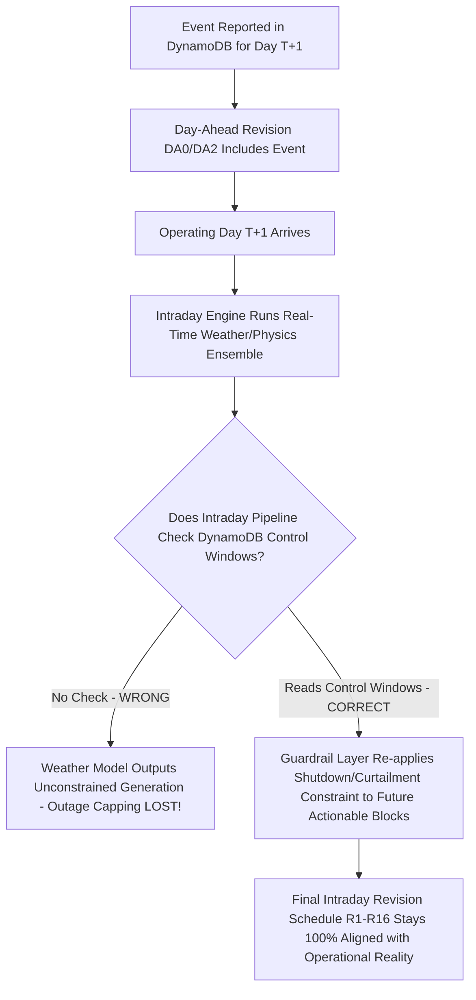

```mermaid
flowchart TD
    A[Event Reported in DynamoDB for Day T+1] --> B[Day-Ahead Revision DA0/DA2 Includes Event]
    B --> C[Operating Day T+1 Arrives]
    C --> D[Intraday Engine Runs Real-Time Weather/Physics Ensemble]
    D --> E{Does Intraday Pipeline Check DynamoDB Control Windows?}
    E -->|No Check - WRONG| F[Weather Model Outputs Unconstrained Generation - Outage Capping LOST!]
    E -->|Reads Control Windows - CORRECT| G[Guardrail Layer Re-applies Shutdown/Curtailment Constraint to Future Actionable Blocks]
    G --> H[Final Intraday Revision Schedule R1-R16 Stays 100% Aligned with Operational Reality]
```
