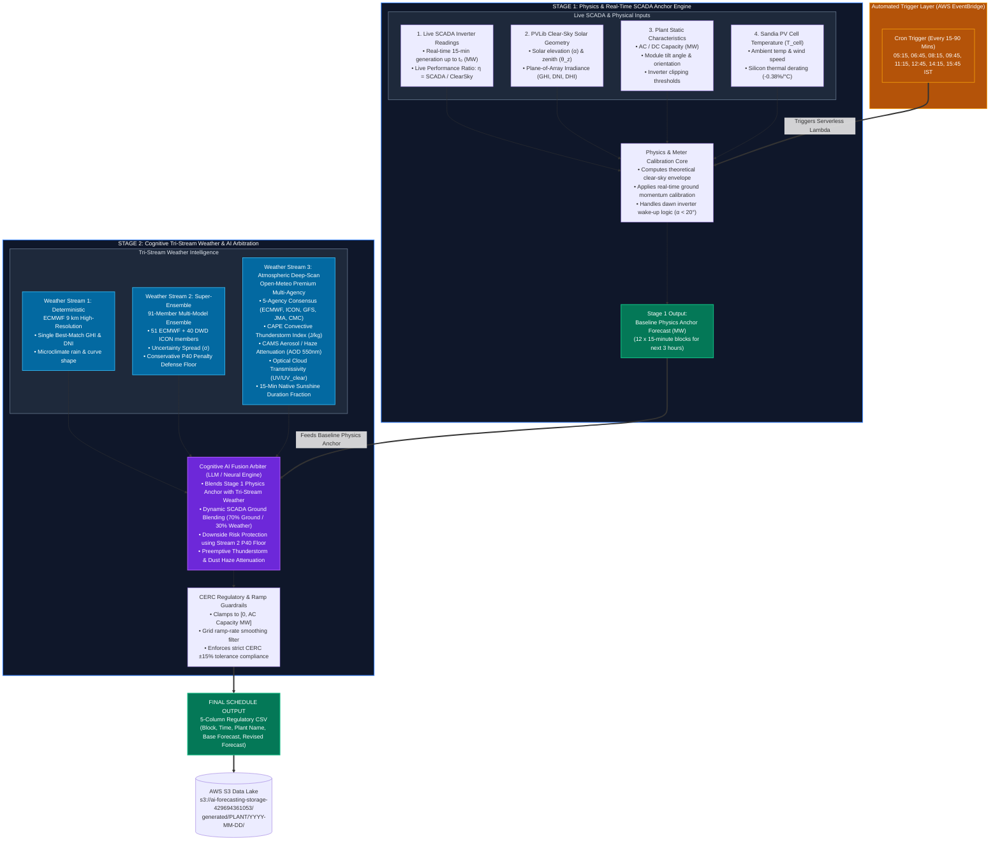

# Industrial AI Solar Power Forecasting Pipeline (2-Stage Architecture)

An automated, cyber-physical solar power forecasting system engineered for utility-scale solar plants. Compliant with **Indian Central Electricity Regulatory Commission (CERC)** and **State Deviation Settlement Mechanism (DSM)** regulations within the strict $\pm 15\%$ tolerance band.

---

## High-Level 2-Stage Pipeline Architecture



---

## Step-by-Step Forecast Generation Process

### Step 0: EventBridge Schedule Trigger
* **Frequencies**: Fired automatically at revision checkpoints (`05:15`, `06:45`, `08:15`, `09:45`, `11:15`, `12:45`, `14:15`, `15:45 IST`).
* **Target Horizon**: 12 continuous 15-minute time blocks (next 3 hours).

### Step 1: Live SCADA Ingestion & Ground Calibration
* Fetches the latest 15-minute generation records up to the revision cutoff ($t_0$).
* Calculates the **Live Performance Ratio**:
  $$\eta_{\text{live}} = \frac{\text{Actual SCADA Power at } t_0}{\text{Theoretical Clear-Sky Power at } t_0}$$

### Step 2: Astronomical Geometry & PVLib Plane-of-Array Physics
* Calculates exact solar elevation angle ($\alpha_s$), zenith ($\theta_z$), and azimuth.
* Translates DNI and DHI to **Plane-of-Array (POA) Irradiance** ($\text{W/m}^2$) based on plant tilt ($\beta$) and orientation ($\gamma_{\text{panel}}$).

### Step 3: Sandia Thermal Loss & Stage 1 Base Anchor
* Ingests ambient temperature ($T_{\text{ambient}}$) and wind speed ($v$).
* Computes cell temperature ($T_{\text{cell}}$) and applies monocrystalline silicon derating ($\gamma = -0.38\% / ^\circ\text{C}$):
  $$T_{\text{cell}} = T_{\text{ambient}} + \text{POA} \cdot \exp(-a - b \cdot v)$$
  $$\mathbf{P}_{\text{anchor}} = \min\left(P_{\text{AC, max}}, \, P_{\text{DC}} \cdot \frac{\text{POA}_{\text{clearsky}}}{1000} \cdot (1 + \gamma (T_{\text{cell}} - 25^\circ\text{C})) \cdot \eta_{\text{live}}\right)$$

### Step 4: Parallel Fetch of Tri-Stream Weather Intelligence
* **Stream 1 (Deterministic)**: ECMWF 9 km High-Resolution deterministic GHI, precipitation, and cloud levels.
* **Stream 2 (Super-Ensemble)**: 91-Member Multi-Model Ensemble (51 ECMWF + 40 DWD ICON). Computes spread $\sigma$ and the **Conservative P40 Risk Floor** to eliminate DSM over-forecasting penalties.
* **Stream 3 (Deep-Scan)**: 5-Agency Consensus (ECMWF, ICON, GFS, JMA, CMC), CAPE convective thunderstorm index ($\text{J/kg}$), CAMS Aerosol Optical Depth (AOD 550nm), and 15-min native sunshine duration.

### Step 5: Cognitive AI Fusion & Arbitration Decision Matrix
The AI Arbiter evaluates the multi-stream evidence and arbitrates the optimal generation curve:

```text
                          ┌───────────────────────────┐
                          │   Stage 1 Physics Anchor  │
                          └─────────────┬─────────────┘
                                        │
             ┌──────────────────────────┼──────────────────────────┐
             ▼                          ▼                          ▼
   [Scenario A: Clear Sky]     [Scenario B: Morning Ramp]  [Scenario C: Volatile Storm]
   • High Agreement (>90%)     • Solar Elev: 15° - 45°     • High Spread (σ > 150 W/m²)
   • Spread σ < 40 W/m²        • Clear ground conditions   • CAPE > 1000 J/kg
   • CAPE < 500 J/kg           • Fast inverter ramping     • Cloud Cover > 60%
             │                          │                          │
             ▼                          ▼                          ▼
   Follow 100% Physics Anchor  Blend 70% SCADA Ground      Clamp Down to Stream 2 P40
   (Full Generation Ceiling)   + 30% Weather Trajectory    (Penalty Protection Floor)
```

### Step 6: Regulatory Safety Clamping & CERC $\pm 15\%$ Guardrails
* Hard physical limits enforced: $0.0 \le P \le P_{\text{AC, max}}$.
* Ramp-rate smoothing filter applied between consecutive 15-minute intervals.
* Early morning dawn inverter awakening threshold verified ($\alpha_s < 20.0^\circ$).

### Step 7: Schedule Formatting & AWS S3 Dispatch
* Merges the 12 revised blocks into the day's master 96-block schedule.
* Formats as the standard 5-column CSV:
  ```csv
  Block,Time,Plant Name,Base Forecast (MW),Revised Forecast (MW)
  24,12:00,KASIPET,14.850,14.250
  25,12:15,KASIPET,14.900,14.300
  ```
* Uploads directly to AWS S3:
  `s3://ai-forecasting-storage-429694361053/generated/<PLANT>/<DATE>/`

---

## Production Multi-Plant Deployment Matrix

All 5 solar power plants execute using this identical, containerized engine on AWS Lambda:

| Plant Name | AC Capacity | DC Capacity | Tilt Angle | Latitude | Longitude |
| :--- | :---: | :---: | :---: | :---: | :---: |
| **SIRMOUR** | 5.1 MW | 5.48 MW | 20.0° | 24.562530 | 75.091403 |
| **KASIPET** | 15.0 MW | 16.50 MW | 15.0° | 19.039439 | 79.436917 |
| **BHUPALPALLY** | 10.0 MW | 11.005 MW | 15.0° | 18.447931 | 79.877263 |
| **KOTHAGUDEM** | 10.0 MW | 11.20 MW | 15.0° | 17.525009 | 80.612501 |
| **OSEPL** | 20.0 MW | 26.00 MW | 20.0° | 21.145800 | 79.088200 |

---

## Project Directory Layout

```text
schedule/
├── config.py                               # Single source of truth for plant profiles and weights
├── run_pipeline.py                         # End-to-end 2-stage execution orchestrator
├── modules/
│   ├── llm/
│   │   └── predictor.py                    # AI Fusion Arbiter & Decision Matrix prompt builder
│   ├── weather/
│   │   ├── weather_fusion.py               # Tri-stream weather fusion engine
│   │   ├── ecmwf_weather.py                # Stream 1: ECMWF 9 km deterministic model
│   │   ├── openmeteo_ensemble.py           # Stream 2: 91-member multi-model super-ensemble
│   │   └── premium_stream3.py              # Stream 3: 5-agency consensus, CAPE, & CAMS AOD
│   ├── physics/
│   │   └── physics_anchor.py               # PVLib clear-sky solar geometry & Sandia cell temp
│   └── feedback/
│       └── daily_feedback.py               # Evening SCADA ground-truth reconciliation
├── Dockerfile.shared-all                   # Container image specification for AWS Lambda
└── README.md                               # This technical specification document
```

---

## AWS Serverless Architecture
* **Compute**: AWS Lambda (Containerized Python 3.11, 2048 MB memory).
* **Execution Time**: Sub-10 seconds average per revision run.
* **Storage**: AWS S3 Bucket `ai-forecasting-storage-429694361053`.
* **Automation**: AWS EventBridge Scheduler Rules.
